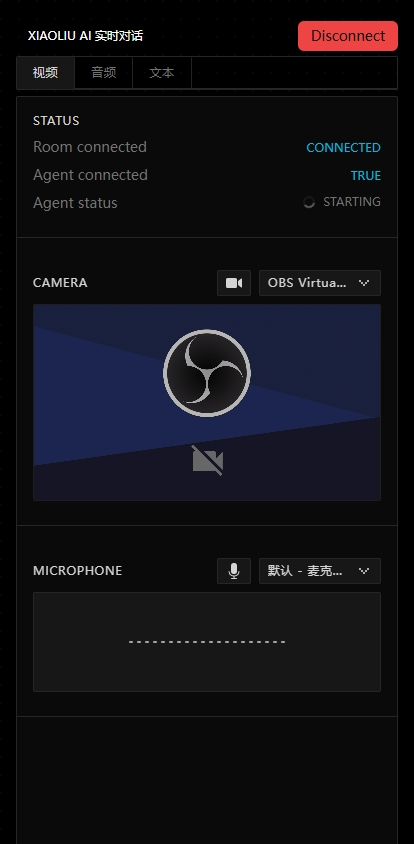
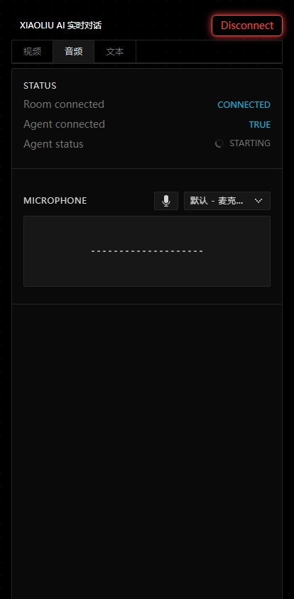
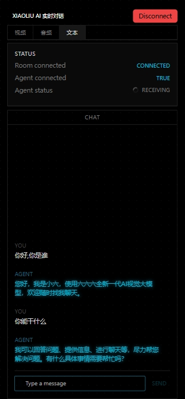

# 项目介绍
该项目是基于livekit和阿里云服务集成的实时大模型通讯项目，实现了实时聊天效果。

视频通话可以输入音频、视频，大模型可以实时分析当前画面，输出音频对话。

音频通话可以输入音频，大模型实时进行聊天，输出音频对话。

文本通话可以输入文本，大模型实时进行聊天，输出音频对话和文本对话。

# 快速开始

本项目无需依赖GPU，需要申请百炼平台账号。所有能力均依赖阿里云百炼平台，仅作演示使用，后续可以依次替换为本地大模型能力。

其中百炼平台能力，需要申请账号，申请地址：https://bailian.console.aliyun.com/#/apply

本项目使用能力：
语音转文本:paraformer-realtime-v2 
大语言模型:qwen-plus
视频分析模型:qwen-vl-max
文本转语音:cosy-voice

## 1. 安装及启动live-kit server
cd livekit-server
livekit-server --dev
官方教程： https://docs.livekit.io/home/self-hosting/local/ 

## 2. 启动agent-quickstart 项目

cd agent-quickstart

export LIVEKIT_URL=http://127.0.0.1:7880

export LIVEKIT_API_KEY=devkey

export LIVEKIT_API_SECRET=secret

export DASHSCOPE_API_KEY=<API_KEY>

export LLM_BASE_URL=<ANY_LLM_API_KEY>

export LLM_API_KEY=<ANY_LLM_API_KEY>

其中LIVEKIT_URL LIVEKIT_API_KEY，LIVEKIT_API_SECRET为livekit server相关配置
，DASHSCOPE_API_KEY、LLM_BASE_URL和LLM_API_KEY为百炼平台的地址和APIKEY

python3 -m venv venv
source venv/bin/activate
pip install -r requirements.txt
python agent.py  dev

## 3.启动前端项目

cd agents-playground

修改.env:
LIVEKIT_API_KEY=devkey
LIVEKIT_API_SECRET=secret
NEXT_PUBLIC_LIVEKIT_URL=ws://127.0.0.1:7880

npm i

npm run dev

